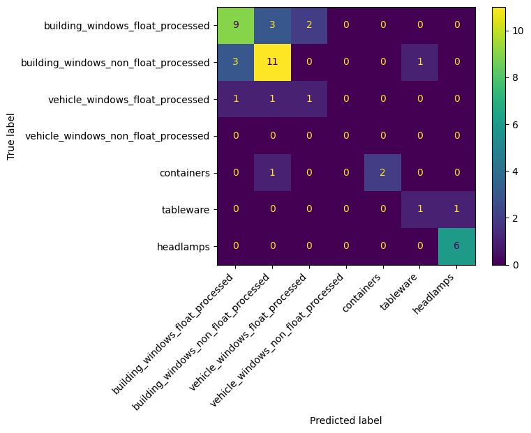
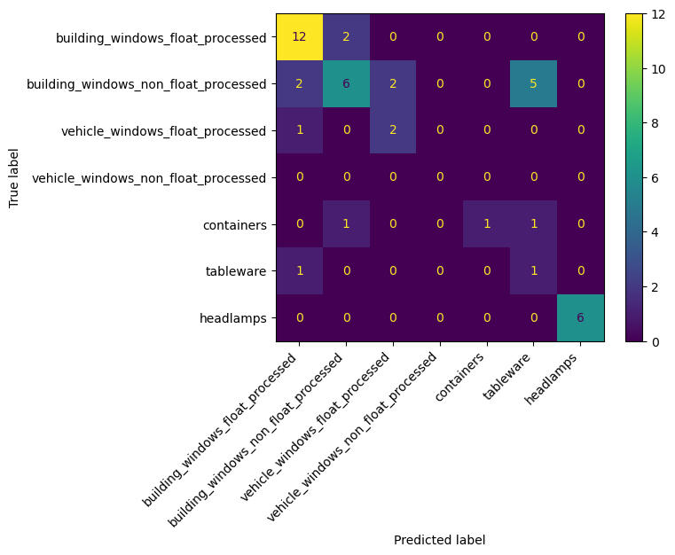
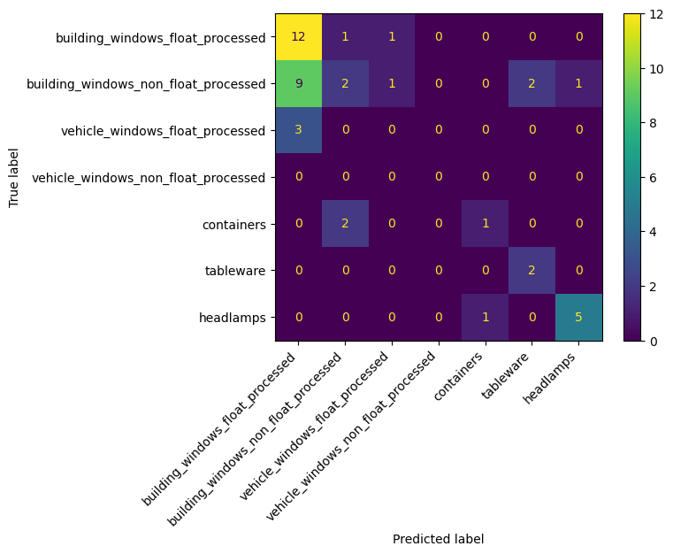

# Machine Learning Models for Glass Classification

[](#k-nearest-neighbour)
[](#decision-trees)
[](#naïve-bayes)

Custom Python implementations of three supervised machine learning models, compared on their ability to identify glass types from refractive index and elemental composition. Explore the implementations and evaluation in [the coursework notebook](Coursework.ipynb).

Originally developed for **SCC222** coursework at **Lancaster University**. The module has since changed, so this repository reflects the coursework at the time of completion.

## Introduction
This project investigates how accurately three classification algorithms identify glass types, comparing their predictive performance and computational cost.

The project compares three supervised learning models:
- **K-Nearest Neighbour (KNN)**
- **Decision Trees (DT)**
- **Naïve Bayes (NB)**

Each model was trained and evaluated on the provided glass classification dataset, and, where possible, its parameters were hypertuned on a validation set to improve predictive performance, reducing the risk of selecting a model that underperforms on unseen data.
The primary goal was to determine which of the implemented models provided the most reliable classification performance metrics and, therefore, was best suited to classifying unseen data.

## The Dataset & Data Preparation
The study uses the **Glass Identification Dataset** from the [UCI Machine Learning Repository](https://archive.ics.uci.edu/dataset/42/glass+identification). The dataset contains **214 glass samples**, represented by **9 features**, with samples from **6 of the 7 defined classes**.

Important to note, this dataset is notably incomplete, as it contains classes that skew the data distribution. This will affect the results, as the models will not be trained fairly across all classes, meaning they will favour represented classes in their predictions over underrepresented ones. Out of all 214 samples:
- 163 Window glass (building windows and vehicle windows)
  - 87 float processed  
    - 70 building windows
    - 17 vehicle windows
  - 76 non-float processed
    - 76 building windows
    - **0 vehicle windows**
- 51 Non-window glass
  - 13 containers
  - 9 tableware
  - 29 headlamps
  
This distribution shows that **Window Glass** is more represented than **Non-Window Glass**, which can bias predictions towards the more common classes. **Non-float-processed vehicle windows** have no samples, so the models implemented here cannot learn or predict that class. Float-processed vehicle windows are represented by 17 samples.

### Splitting The Dataset

For model development and evaluation, the dataset was divided into three subsets:
* **Training set:** 60%
* **Validation set:** 20%
* **Testing set:** 20%

Together, these subsets account for **100% of the available data**. Stratification was used to preserve the class distribution of the original dataset as closely as possible within each subset.

A fixed random seed was used to make the split reproducible and ensure that repeated executions produce the same training, validation, and testing datasets. The original submission used STUDENT_ID as the random seed. However, for privacy, this has been changed in the public release to 42, and all metrics here on out will be based on 42.

Randomising the data before splitting is important because the datasets may be ordered by class or another feature, meaning some classes could be underrepresented or missing entirely from the training dataset, preventing the model from learning how to classify those classes from the sample dataset.

> [!NOTE]
> K-Nearest Neighbours (KNN) requires an additional preprocessing step: z-score standardisation. The scaler is fitted only to the training set and then applied to the validation and testing sets using the same learned parameters. This prevents data leakage while ensuring each feature is placed on a comparable scale, so features with larger numerical ranges do not disproportionately influence KNN's distance calculations.

The training set is used to fit each model, while the validation set is used to evaluate different model configurations and select suitable hyperparameters. Examples include the value of k for KNN and the maximum tree depth for the Decision Tree model. However, the Naïve Bayes implementation used in this project was not hyperparameter-tuned, and so the training and validation sets were combined to increase the training set to 80% of the total data.

The testing set remains separate throughout training and hyperparameter tuning and is used only after training has been finalised, providing an evaluation of how well the model predicts on previously unseen data.

## Methodology
Each model is trained on the same subset splits to ensure fairness. However, as stated before, KNN uses z-score standardisation to place features on comparable scales, preventing features with larger numerical ranges from disproportionately influencing distance calculations.

### K-Nearest Neighbour
This model tracks the distance between a sample and the training set; it selects the K-nearest samples from the training set, and the class that appears most often among them is selected as the prediction.

K can be hypertuned to find the optimal value for a given dataset. In this case, K=1 was found to be the best K value.

KNN can support multiple distance metrics, and several have been implemented in the class. However, I found that for this dataset, using the maximum distance metric was optimal compared to Euclidean and other distance metrics. All implemented distance metrics include:
|Distance Metric|Meaning|Equation|
|-|-|-|
|Maximum Distance| The maximum distance measures the largest distance between features of two data points rather than the mean distance. | $d(x,y) = \max_i \|x_i-y_i\|$ |
| Squared Euclidean Distance | Measures the straight-line distance between two samples based on their feature values. Squared and non-squared Euclidean produce the same neighbour ordering. | $d(x,y) = \sum_{i=1}^{n}(x_i-y_i)^2$ |
| Manhattan Distance | The distance between two samples by summing the absolute differences between their feature values. It can be thought of as travelling along a grid rather than taking a direct straight-line path. | $d(x,y) = \sum_{i=1}^{n}\lvert x_i-y_i \rvert$ |

> [!NOTE]
> While KNN can use a variety of distance metrics, this project implements only three approaches within the KNN class: **Squared Euclidean distance**, **Manhattan distance**, and **Maximum distance**.

### Decision Trees
This model recursively splits the training data based on feature values to create a tree of nodes (decisions). For each sample, the model follows these rules from the root to a leaf node, selecting the resulting class as the prediction.

A **root node** is the first node in a decision tree and represents the initial decision or split applied to the dataset, while a **leaf node** is an end node with no further branches, representing the final prediction or class assignment to the sample.

Decision Trees have two hyperparameters that can be tuned in this project: maximum depth and minimum samples. Maximum depth limits how many levels the tree can grow, helping control its complexity. Minimum samples defines the minimum number of samples required at a node before it can be split further; if this threshold is not met, the node becomes a leaf node and produces a final prediction. In this project, the ```maximum depth = 1``` and ```minimum samples split = 2```.

Additionally, Decision Trees can use different methods to determine the best feature and threshold for each split. The two most common approaches are Gini Impurity and Entropy. Gini impurity is the measure of how mixed the classes are within a node. A lower Gini score indicates that the node contains samples from fewer classes and is therefore purer, while Entropy measures the uncertainty within a node. Splits are selected based on the reduction in entropy, often referred to as information gain. However, for this project, I opted to use Gini Impurity as the split criterion because of its simplicity and efficiency in measuring node purity.

### Naïve Bayes
This model evaluates each sample against every class using the class's prior probability, feature means, and feature variances to estimate the likelihood that the sample belongs to that class. The class with the highest resulting probability is selected as the prediction.

Naïve Bayes assumes that each feature is conditionally independent of the others given the class. This simplifies the calculation by allowing the likelihood of each feature to be evaluated independently and then combined with the class prior.

For each feature, the likelihood is calculated using the Gaussian Equation:

$P(x_i \mid C) = \frac{1}{\sqrt{2\pi\sigma_C^2}} \exp\left(-\frac{(x_i-\mu_C)^2}{2\sigma_C^2}\right)$

The individual feature likelihoods are then combined with the class prior to determine the most probable class for the sample.

## Understanding Performance Metrics
Several metrics are tracked for each model to assess its performance and computational efficiency:
|Performance Metric|How its tracked|
|-|-|
|Model Accuracy| After training and, where applicable, hyperparameter tuning, the model is evaluated using a test dataset containing previously unseen samples. The predicted classifications are compared with the known classes, with accuracy defined as the percentage of samples correctly classified.|
|Training Time| Measures the total time, in seconds, required to train the model, including hyperparameter tuning where applicable. Timestamps are recorded immediately before and after training. This provides an indication of the computational cost of training the model, although results may be influenced by factors such as hardware performance, system load, and implementation complexity.
|Testing Time| Measures the total time, in seconds, required for the trained model to generate all predictions for the test dataset. Timestamps are recorded immediately before and after testing. This, much like the training time, indicates the computational cost of predicting classes with the model, and may still be affected by hardware and implementation factors.
|F1 Scores| Measures classification performance by combining precision and recall into a single metric. It is particularly useful when evaluating individual classes or datasets with uneven class distributions. A higher F1 score indicates a better balance between correctly identifying samples belonging to a class and avoiding incorrect classifications into that class.
|Confusion Matrices | Used to visualise how each model's predictions compare with the true classifications in the testing set. The diagonal values represent correctly classified samples, while values outside the diagonal represent misclassifications between classes.|

## Results
| Metric | K-Nearest Neighbour | Decision Trees | Naïve Bayes |
|-|-|-|-|
|Accuracy|69.77%|65.12%|51.16%|
|Training Time|0.0565s|0.0436s|0.0006s|
|Testing Time|0.0107s|0.0001s|0.0043s|
|F1 Scores|66.67%, 70.97%, 33.33%, 0.00%, 80.0%, 50.0%, 92.31%|80.0%, 50.0%, 57.14%, 0.00%, 50.0%, 22.22%, 100.0%|'63.16%', 20.0%, 0.0%, 0.00%, 40.0%, 66.67%, 83.33%|
|Confusion Matrices||||

## Project Conclusion
In conclusion, K-Nearest Neighbour (KNN) was the best-performing model for classifying glass by elemental composition, given the dataset used. KNN achieved an overall accuracy of 69.77%, compared with 65.12% for Decision Trees and 51.16% for Naïve Bayes. However, KNN was the slowest of the three models, taking a combined 0.0672s to complete training and testing. Given the dataset's small size, this difference was negligible, and the improvement in predictive accuracy outweighed the additional computational cost.

KNN also struggled with some of the underrepresented classes, as reflected by lower F1 scores and misclassifications within the confusion matrix. This suggests that there were insufficient training samples for the model to reliably learn the characteristics of these classes. Similar difficulties were observed across all three models, which was expected given the noticeable class imbalance and the absence of samples for one of the defined classes, as discussed in the dataset preparation section.

Overall, the results demonstrate that model performance is highly dependent on the dataset's characteristics and distribution, and would likely have benefited from a more balanced and complete dataset, particularly for the underrepresented classes, as well as from investigating alternative distance metrics and hyperparameter configurations. However, for the dataset and configurations evaluated in this project, KNN provided the strongest overall predictive performance of the three models tested.


